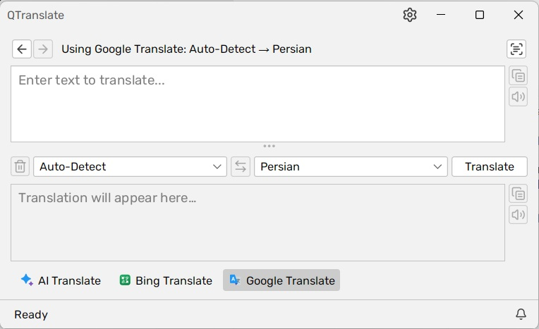
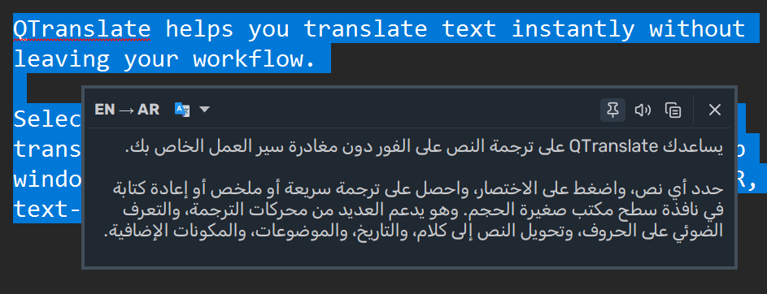
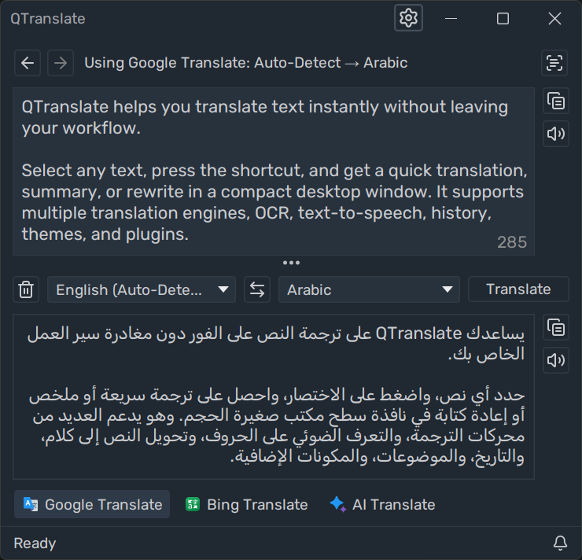
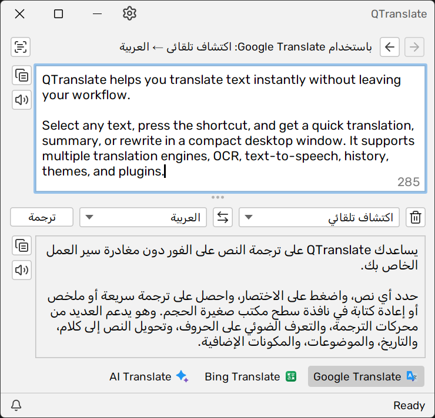
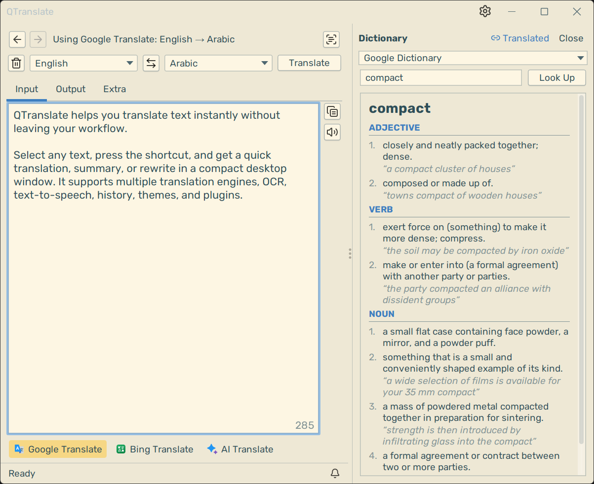
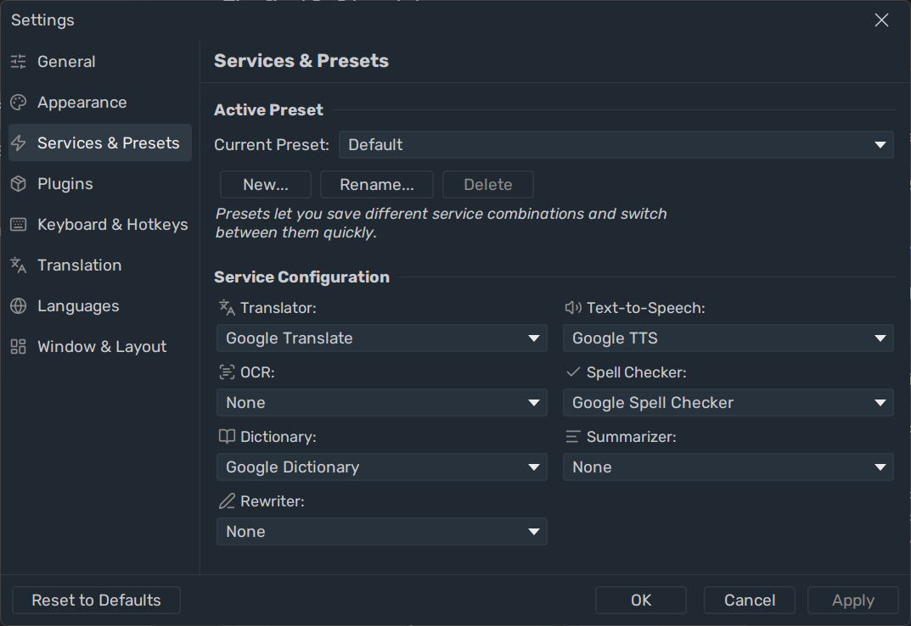

<div align="center">


# QTranslate Persian

**Fork of [QTranslate](https://github.com/ahatem/QTranslate) with Persian (`fa`) translation support**

ابزار ترجمه دسکتاپ — با پشتیبانی **ترجمه خودکار به فارسی** (Auto-Detect → Persian)

[](LICENSE)
[](https://github.com/ahatem/QTranslate)
[](https://kotlinlang.org)

[**Build & Run**](#build--run) · [**Persian translation**](#persian-translation-auto--fa) · [**Upstream README**](#about-upstream) · [**Wiki**](wiki/Home.md)

<br>


<br><sub>Auto-Detect → Persian with Google Translate</sub>

</div>

---

## About this fork

This repository is a **fork** of [ahatem/QTranslate](https://github.com/ahatem/QTranslate) — a modern, plugin-based rewrite of the classic Questsoft QTranslate.

Maintained by [@l4tr0d3ctism](https://github.com/l4tr0d3ctism). Original project by [@ahatem](https://github.com/ahatem).

### What we added

| | |
|---|---|
| **Persian in Google Translate** | Language code `fa` added to the default Google plugin (was missing upstream) |
| **Persian OS default** | On a Persian (`fa`) Windows locale, the default **target** language is Persian |
| **Build mirror** | Aliyun Maven mirror for Google dependencies (when `dl.google.com` is unreachable) |

> **Note:** This fork adds **text translation to Persian**, not a Persian UI. Menus stay in English (or other bundled UI languages from upstream).

### Persian translation (Auto → fa)

1. **Source language:** Auto-Detect  
2. **Target language:** Persian  
3. Type or paste text → **Translate**

Works with the bundled **Google Translate**, **Bing**, and **AI** plugins.

---

## Build & Run

**Requires Java 17+** — [Adoptium](https://adoptium.net)

```powershell
git clone -b develop https://github.com/l4tr0d3ctism/QTranslate-Persian.git
cd QTranslate-Persian

# Windows — set JAVA_HOME if needed
$env:JAVA_HOME = "C:\Program Files\Java\jdk-17"

.\gradlew.bat :app:shadowJar `
  :plugins:google-services:shadowJar `
  :plugins:bing-services:shadowJar `
  :plugins:ai-services:shadowJar `
  "-Dorg.gradle.java.home=$env:JAVA_HOME"
```

Then assemble a portable folder:

```
QTranslate/
  ├── QTranslate.jar          ← from app/build/libs/
  ├── plugins/
  │     ├── google-services-plugin.jar
  │     ├── bing-services-plugin.jar
  │     └── ai-services-plugin.jar
  ├── languages/              ← copy from repo languages/
  └── themes/                 ← copy from repo themes/
```

Run:

```powershell
java -jar QTranslate.jar
```

> **Releases:** No pre-built release yet — build from source above. Upstream releases: [ahatem/QTranslate/releases](https://github.com/ahatem/QTranslate/releases)

---

## About upstream

The original QTranslate by Questsoft was the best desktop translation tool on Windows — until development stopped, APIs broke, and users were left with a dead app.

This is a full rewrite in Kotlin with one core design change: **everything is a plugin.** Translation engines, OCR, TTS, spell checkers, dictionaries — all separate JARs you install at runtime. When a service changes its API or shuts down, you swap the plugin. The app keeps running.

---

## What it does

Select text anywhere → press `Ctrl+Q` → translation appears instantly. That's the core of it.

<div align="center">

<br><sub>Quick Translate — select text in any app, press <kbd>Ctrl+Q</kbd></sub>
</div>

<br>

For longer work: open the main window, type or paste, translate. Switch engines in one click. Run OCR on a screenshot. Listen to pronunciation. Check spelling. Browse history. All from the keyboard, all without opening a browser.

<div align="center">
<table>
<tr>
<td align="center" width="50%">
<br>
<sub><b>Main window</b> — translate, summarize, rewrite, spell check, browse history</sub>
</td>
<td align="center" width="50%">
<br>
<sub><b>RTL support</b> — full layout mirroring for Arabic, Hebrew, Farsi, and more</sub>
</td>
</tr>
<tr>
<td align="center" width="50%">
<br>
<sub><b>Compact layout, light theme</b> — tabbed view, fits any workflow</sub>
</td>
<td align="center" width="50%">
<br>
<sub><b>Settings — Services &amp; Presets</b> — configure engines, presets, and API keys</sub>
</td>
</tr>
</table>
</div>

---

## Features

### Translation

| | |
|---|---|
| **Quick Translate popup** | `Ctrl+Q` on any selected text — popup with result, no main window needed |
| **Instant translation** | Translates as you type with configurable debounce |
| **Inline replace** | `Ctrl+Shift+T` — translates selected text and pastes the result back in place |
| **Backward translation** | See the round-trip result alongside the main output — spots awkward phrasing instantly |
| **Summarize** | Get a condensed version of long text, configurable length |
| **Rewrite** | Rewrite in a different style: Formal, Casual, Concise, Detailed, or Simplified |
| **Translation history** | Full undo/redo through every past translation |
| **Translation rules** | Auto-correct source text before translating — fix common mistakes, expand abbreviations, normalize input |

### Input

| | |
|---|---|
| **Screen OCR** | Draw a rectangle anywhere on screen — translate, copy text, copy image, or save; re-crop without closing |
| **Spell checking** | Live underlines as you type, click a suggestion to apply |
| **Remove line breaks** | Strips newlines from pasted text so PDF content translates as sentences |
| **Language filter** | Pin 3–4 target languages so the picker isn't overwhelming |
| **Cycle languages** | `Ctrl+L` steps through pinned languages without touching the mouse |

### Services & plugins

| | |
|---|---|
| **Plugin system** | Install `.jar` plugins at runtime — no restart, no reinstall |
| **Service presets** | Save different engine combinations for different contexts |
| **Google Services** | Translator, TTS, OCR, Spell Checker, Dictionary — included |
| **Bing Services** | Translator, TTS, Spell Checker — included |
| **AI Services** | Translator, Summarizer, Rewriter, Spell Checker, Dictionary, Vision OCR — via [OpenRouter](https://openrouter.ai) (300+ models, one API key) — included |

### Interface

| | |
|---|---|
| **Three layouts** | Classic (stacked), Side-by-side, Compact (tabbed) |
| **Global hotkeys** | Every action is bindable, configurable as global or app-local |
| **RTL support** | Full layout mirroring for Arabic, Hebrew, Farsi, and more |
| **30+ themes** | Dark and light via FlatLaf, with animated transitions — drop any IntelliJ `.theme.json` into the `themes/` folder to add more |
| **Portable** | Runs from any folder, all data lives next to the JAR |

---

## Installation (upstream)

**Requires Java 11 or later** — [download from Adoptium](https://adoptium.net) if you need it.

For **this fork**, see [Build & Run](#build--run) above. For the official upstream build:

1. Download `QTranslate-<version>.zip` from [**Releases**](https://github.com/ahatem/QTranslate/releases/latest)
2. Unzip anywhere
3. Run `QTranslate.jar`

```
QTranslate/
  ├── QTranslate.jar                  ← double-click, or: java -jar QTranslate.jar
  ├── plugins/
  │     ├── google-services-plugin.jar
  │     ├── bing-services-plugin.jar
  │     └── ai-services-plugin.jar
  ├── themes/
  │     └── kokedera.theme.json       ← community theme included; drop more .theme.json files here
  └── languages/
        ├── ar-SA.toml
        ├── zh-CN.toml
        ├── de-DE.toml
        └── ...
```

Google, Bing, and AI plugins are included. Add your API keys in **Settings → Plugins → [plugin] → Configure**.

> **Getting "This application requires a Java Runtime Environment"?**
> Java isn't installed or `JAVA_HOME` isn't set. This video covers the full process:
> **▶ [How to Install Java JDK and Set JAVA_HOME](https://youtu.be/VTzzmqNwGzM)** *(first 7 minutes)*

**Build from source** → [Building from Source](wiki/Building-from-Source.md)

---

## Quick start

1. Launch `QTranslate.jar` — it starts in the system tray
2. Select text anywhere on screen
3. Press `Ctrl+Q` — Quick Translate popup opens with the result ready
4. Press `Ctrl+D` — open the Dictionary for the selected word
5. Press `Ctrl+E` — listen to the selected text
6. Press `Ctrl+I` — draw a screen region to OCR and translate

Open **Settings** (gear icon) to configure API keys, themes, hotkeys, and service presets.

---

## Plugins

**Installing a plugin:** Settings → Plugins → Install Plugin → select `.jar` → Enable → Configure → assign in Services & Presets

**Full guide** → [Installing Plugins](wiki/Installing-Plugins.md)

### Community plugins

> **Built a plugin?** Publish it on GitHub with the `qtranslate-plugin` topic and a `qtranslate-plugin.json` in your repo — it will appear automatically in QTranslate's built-in marketplace.
> → [Plugin publishing guide](wiki/Creating-a-Plugin.md#publishing-on-github)

| Plugin | Services | Author |
|--------|----------|--------|
| *(be the first — it's 50 lines of Kotlin)* | | |

---

## Build a plugin

A minimal translator is ~50 lines of Kotlin. No framework, no registration — implement a few interfaces, build a fat JAR, install it through the UI.

```kotlin
class MyPlugin : Plugin<PluginSettings.None> {
    override val id      = "com.example.my-plugin"
    override val name    = "My Plugin"
    override val version = "1.0.0"

    override fun getSettings() = PluginSettings.None
    override fun getServices() = listOf(MyTranslatorService())
}
```

The bundled Google, Bing, and AI plugins are fully open source in `plugins/` — they're the best real-world reference for auth, language mapping, error handling, and settings.

**Full guide** → [Creating a Plugin](wiki/Creating-a-Plugin.md)

---

## Translate the interface

QTranslate ships with 13 languages built in:

**Arabic · Bengali · Chinese · English · French · German · Hungarian · Italian · Japanese · Portuguese · Russian · Spanish · Turkish**

Want another language? Copy `languages/en.toml`, rename it to your language code, translate the values. No code needed.

**Guide** → [Adding a Language](wiki/Adding-a-Language.md)

---

## Architecture

Clean Architecture + MVI. Nothing leaks between layers:

```
:api          ← plugin interfaces — plugins only depend on this
:core         ← business logic, use cases, MVI stores
:ui-swing     ← Swing UI, Renderable<State> components
:app          ← composition root
:plugins/*    ← Google, Bing, AI, community plugins
:plugins/common ← shared HTTP client, JSON, language utilities
```

**Guide** → [Architecture](wiki/Architecture.md)

---

## Support

If QTranslate saves you from Alt-Tabbing to Google Translate a dozen times a day, a coffee is always appreciated!

[](https://www.buymeacoffee.com/ahmedhatem)

---

## Contributing

Bug fixes, features, translations, docs, and plugins all welcome. Look for [`good first issue`](https://github.com/ahatem/QTranslate/labels/good%20first%20issue) for well-scoped starting points.

→ [Contributing Guide](CONTRIBUTING.md)

---

[MIT License](LICENSE) — same as [upstream](https://github.com/ahatem/QTranslate/blob/develop/LICENSE)

<div align="center">
<br>
<sub>Fork: <a href="https://github.com/l4tr0d3ctism/QTranslate-Persian">l4tr0d3ctism/QTranslate-Persian</a> · Upstream: <a href="https://github.com/ahatem/QTranslate">ahatem/QTranslate</a></sub>
<br>
<sub>Built with Kotlin · FlatLaf · Ktor · Coroutines</sub>
<br><br>
<sub>Found it useful? A ⭐ helps other people find the project.</sub>
</div>
